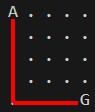

**What it does**

This project trains an AI agent to navigate a grid environment using reinforcement learning. The agent starts with no knowledge of the optimal path and learns through trial and error to reach the goal efficiently. After training, the agent consistently finds one of the mathematically optimal 8-step solutions.

**How it works**

The system uses Q-learning with an epsilon-greedy exploration strategy to build knowledge about which actions work best from each grid position. The agent starts with completely random behavior but gradually shifts toward exploiting learned strategies as training progresses. I implemented a custom environment following Gymnasium API standards with step(), reset(), and render() methods for compatibility with standard RL frameworks. The agent maintains a Q-table that gets updated after each action using temporal difference learning and the Bellman equation. Training runs for 100,000 episodes with epsilon decay scheduling, though the agent converges to optimal behavior within the first 20,000 episodes. The final trained agent consistently executes one of the two mathematically optimal 8-step paths from start to goal.

**Results**

The training results demonstrate successful convergence to near-optimal performance across all key metrics. The agent achieves consistent rewards of ~9.9 (98% of maximum possible), representing optimal 8-10 step solutions compared to the theoretical minimum of 8 steps. Learning stabilizes within 20,000 episodes, with episode lengths dropping from over 100 steps to under 10, and training errors converging to near-zero. This indicates the Q-learning implementation successfully learned an optimal navigation policy with minimal exploration overhead.

The red trail shows the optimized route the program ended up taking, it shows on of the two possibilties for an 8 step route. The other option would be alternating "right" and "down".

**Implementation Details**

The implementation consists of three core Python components: a custom grid environment following Gymnasium API standards with step(), reset(), and render() methods, a Q-learning agent using epsilon-greedy exploration with temporal difference updates, and a training loop with hyperparameter scheduling. The environment handles state transitions and reward calculation (+10 for goal, -0.01 per step), while the agent maintains a Q-table updated via the Bellman equation with a learning rate of 0.01 and epsilon decay from 1.0 to 0.1 over 50,000 episodes. The system uses numpy for numerical operations and matplotlib for visualization, with the Q-table implemented as a defaultdict for automatic initialization of new state-action pairs.

**Conclusion and Other Remarks**

**Hyperparameter Analysis:** Lower learning rates (0.001) would require more episodes to converge but might find more stable solutions, while higher rates (0.1) could cause instability or overshooting. Your choice of 0.01 balanced convergence speed with stability. Faster epsilon decay would reduce exploration too quickly, potentially missing optimal policies, while slower decay would take longer to exploit learned knowledge. Your 50,000-episode decay struck a reasonable balance.

**Scalability Challenges:** This approach faces the "curse of dimensionality" - a 10x10 grid has 100 states versus your 25, but a 20x20 grid has 400 states requiring exponentially more memory and training time. The Q-table grows quadratically with grid size, making this method impractical for large environments. Deep Q-Networks (DQN) or policy gradient methods would be necessary for grids larger than roughly 15x15.

**Extensions:** Adding obstacles would create interesting navigation challenges and test the algorithm's ability to find alternate paths. Multiple goals could be implemented with reward shaping (different goal values) or random goal placement per episode. However, obstacles might create states with no valid actions, requiring careful environment design to ensure all states remain reachable.